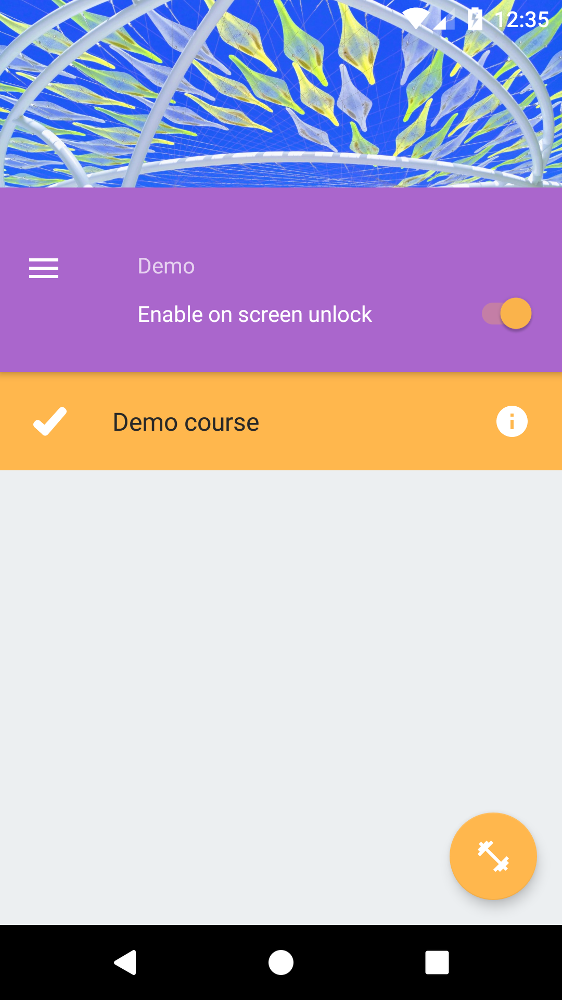
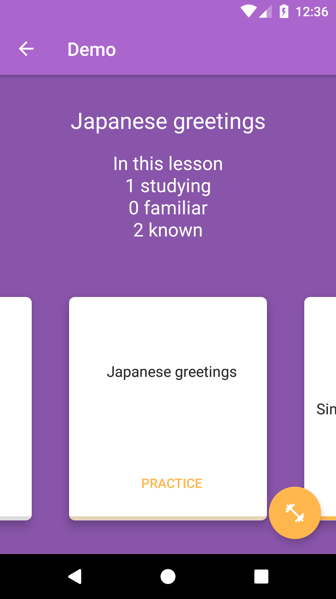
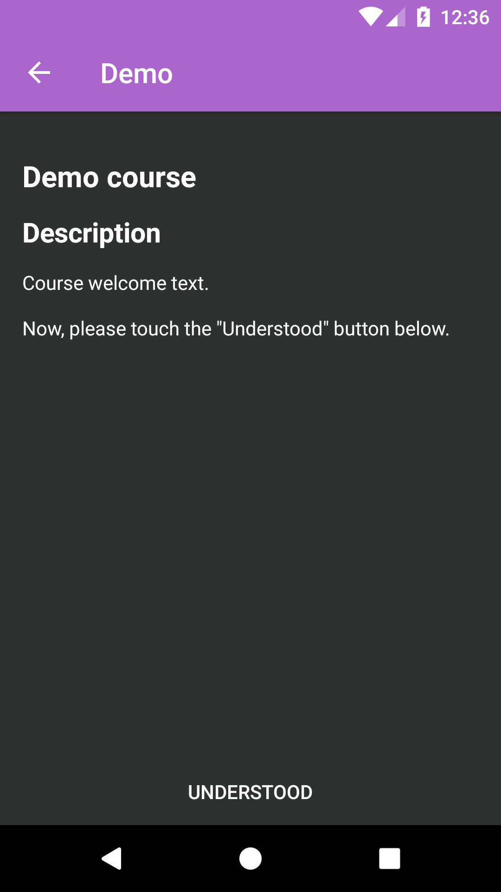
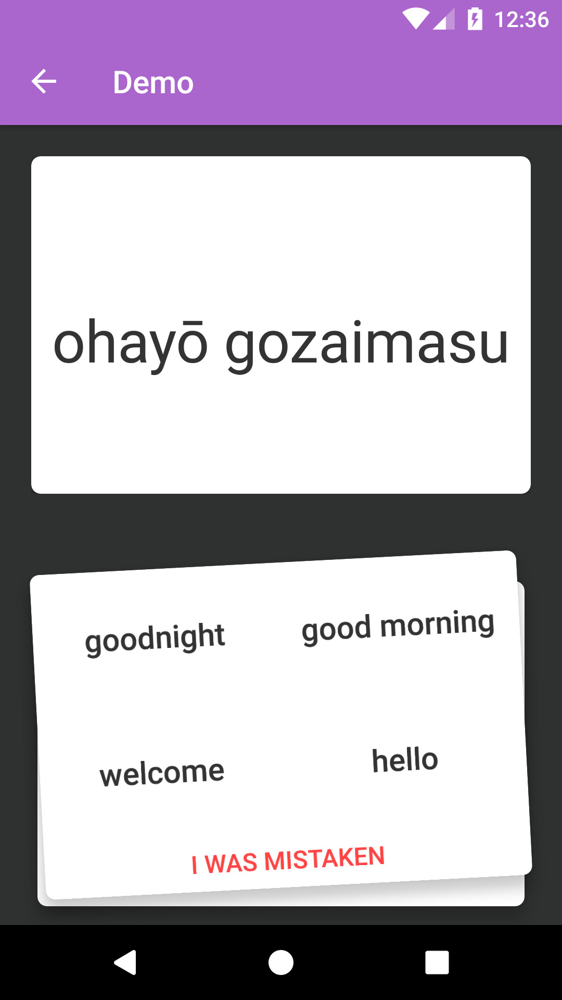
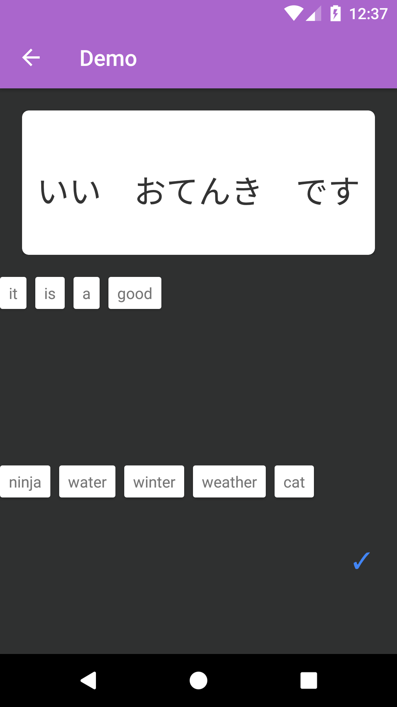
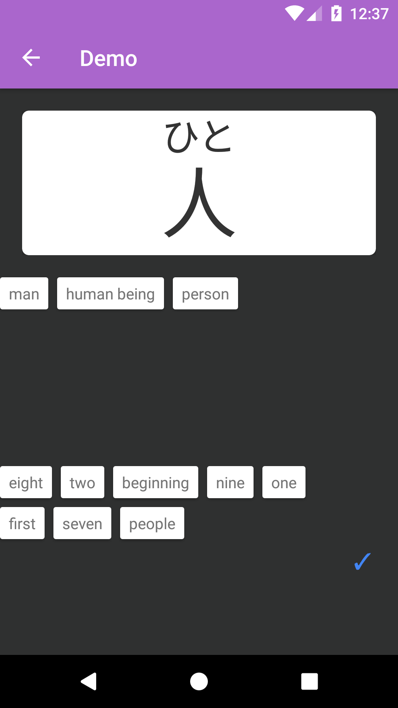
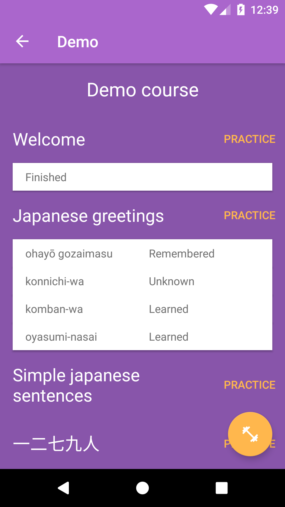
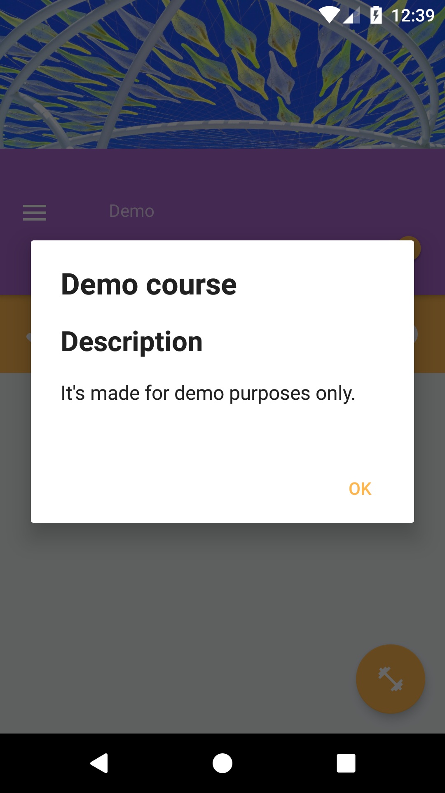

## Erubit Learning platform 
Platform for creating innovative educational Android applications.

### Sample apps

[Erubit Kana](https://play.google.com/store/apps/details?id=com.erubit.kana) for learning japanese syllabaries.

[Erubit English](https://play.google.com/store/apps/details?id=com.erubit.english) to learn TOEIC and TOEFL most frequent words. 

Any contributions and translations are highly welcome.

### Description
Platform-based apps are especially useful for people who are constantly busy and can't find even 30 minutes to learn.

Using innovative techniques, people will learn something new based on the latest micro-learning technologies.

Each time the device screen unlocked, user will see a new word or piece of information for learning, or a mini-test to test knowledge of the lessons had already learned.

It takes only a couple of seconds, and the more effectively the training goes.

#### Screenshots


### Operation manual
#### How to create applications
There is a `demo` project in source code for the reference.

Let's create new platform-based application, let name it `demo` as already existing sample.
1. Create new empty Android application without adding activity.

2. Make it dependant of the platform library:

In the `demo/build.gradle` file add `compile project(':erubit.platform')` in the `dependencies` section.
```gradle
dependencies {

 →  compile project(':erubit.platform')

}
```

3. Add new empty java class `NavActivity` at `demo/src/main/java/<your package path>/`

```java
public class NavActivity extends a.erubit.platform.android.NavActivity {

}
```
This is your main activity. Update manifest:
```xml
    <application
        android:name="a.erubit.platform.android.App"
        android:allowBackup="true"
        android:icon="@mipmap/ic_launcher"
        android:label="@string/app_name"
        android:supportsRtl="true"
        android:theme="@style/AppTheme"
        android:fullBackupContent="@xml/backup_descriptor">
        <activity
            android:name=".NavActivity"
            android:label="@string/app_name"
            android:configChanges="orientation|screenSize|keyboardHidden"
            android:theme="@style/AppTheme.NoActionBar">
            <intent-filter>
                <action android:name="android.intent.action.MAIN" />
                <category android:name="android.intent.category.LAUNCHER" />
            </intent-filter>
        </activity>
    </application>
```

4. Create educational courses

#### How to create courses
All courses are Android `raw` resource files.

Sample courses, developed for the [Erubit Kana](https://play.google.com/store/apps/details?id=com.erubit.kana) app are located in [this Github project](https://github.com/erubit-open/kana-courses).
 
Multilingual apps are supported by default by Android's localization principles.

For example:
```
+ raw
  - _contents.json
  - demo.json
  - demo_1.json
  - demo_2.json
  - demo_3.json
  - demo_welcome.json
```

##### Entry point
Entry point, containing list of courses is a `__contents.json` file
```json
[
  { "active": true, "name": "demo" }
]
```
* `"active": true|false` is an initial state of course, user will define courses to learn by himself
after first launch.
* `"name"` is file containing course lessons

##### Course
File name should be `demo.json` as `"name"` field in `__contents.json` file.
```json
{
  "id": "<string id>",
  "title": "@ref ref_hiragana_title",
  "description": "@ref ref_hiragana_description",
  "lessons": [
    "hiragana_welcome",
    "hiragana_a",
    "hiragana_ka"
  ]
}
```
* `"id"` any string
* `"title"` and `"description"` fields might be either a normal text or a reference.
References are used for [multilingual support][#multilingual].

##### Lesson
```json
{
  "id": "36eb7c0",
  "title": "@ref ref_hiragana_a_title",
  "type": "Set",
  "set": [
    { "i": 0, "c": "あ", "m": "a" },
    { "i": 1, "c": "い", "m": "i" },
    { "i": 2, "c": "う", "m": "u" },
    { "i": 3, "c": "え", "m": "e" },
    { "i": 4, "c": "お", "m": "o" }
  ],
  "variants": [
    "a",   "i",   "u",   "e",  "o"
  ]
}
```
* `"type"` should be `"Set"`. Another types of lessons are sampled in `Demo` project.
* `"set"` is a list of characters to learn
* `"variants"` is a list of possible wrong answers

##### <a name="multilingual"></a>Multilingual support
Text fields, like titles might be translatable for many languages.

```
"title": "Hiragana"
```

**or**

```
"title": "@ref ref_hiragana_title"
```

and in this case

* `courses/ref_hiragana_title` contents:
```
Hiragana
```
* `courses-ru/ref_hiragana_title` contents:
```
Хирагана
```


